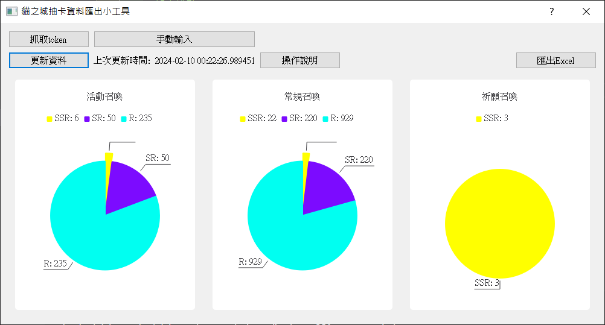
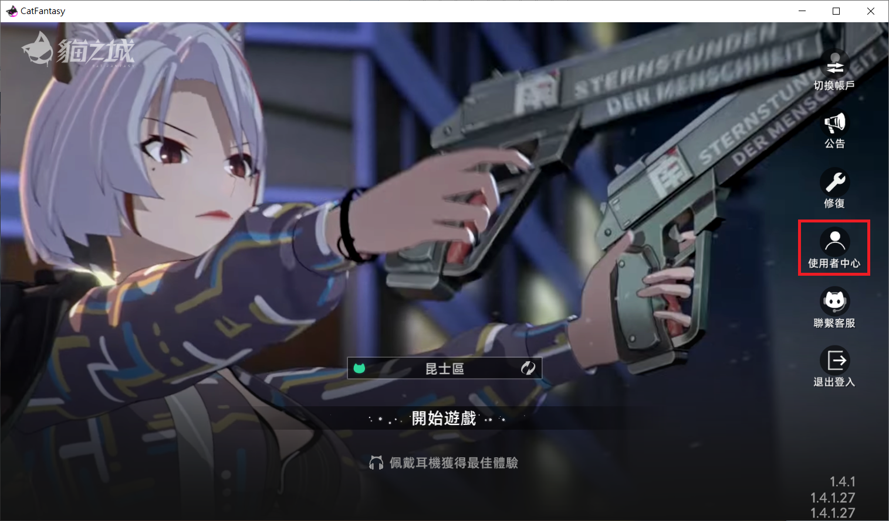
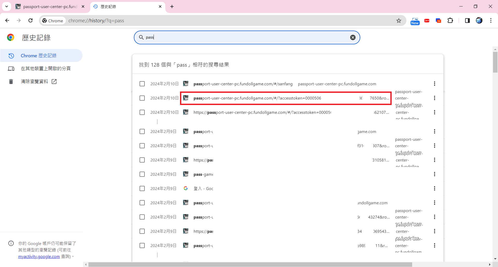

# 貓之城召喚紀錄統計
* 這是個嘗試通過貓之城提供的自助查詢功能整理召喚紀錄的repo

## 畫面展示

## 使用步驟
* 使用時，分為三個步驟：抓取token、更新資料與匯出Excel

### 第一步：抓取token
* 可以使用手動新增或自動新增的方式
* 手動新增時，直接點選手動輸入按鈕，填入三個對應數值即可
* 三個對應數值可以依照以下步驟得到
  1. 在電腦版中，點擊登入畫面的使用者中心
  

  2. 在瀏覽紀錄中，可以在網址的問號後方得到相關的數值
  

* 自動新增時，需點選過使用者中心按鈕，並在按下「抓取token」前關閉瀏覽器，程式會從你的瀏覽紀錄中取得最新一次登入使用者中心的token

### 第二步：更新資料
* 點擊更新資料按鈕，會依照得到的token抓取對應帳號的召喚紀錄
* 由於官方資料庫限制，只能抓取到一個月內的召喚紀錄
* 抓取完畢後，會以圓餅圖的形式顯示在畫面中

### 第三步：匯出Excel
* 點擊匯出Excel按鈕，選擇儲存位置與檔名後，即可獲得詳細的召喚清單